# 04 — Modelo Entidad-Relación

> Diagrama ER completo en Mermaid. Es la referencia visual del
> [Diccionario de Datos](03-diccionario-datos.md). Todas las entidades de dominio cuelgan
> de `schools` por `school_id` (no se dibujan todas las aristas a `schools` para no saturar;
> se indican las relaciones de negocio).

```mermaid
erDiagram
    SCHOOLS ||--o{ USERS : "tiene"
    SCHOOLS ||--o{ ALUMNOS : "tiene"
    SCHOOLS ||--o{ DOCENTES : "tiene"
    SCHOOLS ||--o{ GRADOS : "tiene"
    SCHOOLS ||--o{ GRUPOS : "tiene"
    SCHOOLS ||--o{ MATERIAS : "tiene"
    SCHOOLS ||--o{ PERIODOS : "tiene"
    SCHOOLS ||--o{ CICLOS_ESCOLARES : "tiene"

    CICLOS_ESCOLARES ||--o{ GRUPOS : "encuadra"
    CICLOS_ESCOLARES ||--o{ PERIODOS : "encuadra"
    CICLOS_ESCOLARES ||--o{ ASIGNACIONES : "encuadra"

    USERS ||--o| DOCENTES : "perfil"
    USERS ||--o| TUTORES : "cuenta_portal"

    GRADOS ||--o{ GRUPOS : "agrupa"
    GRUPOS ||--o{ ALUMNOS : "contiene"
    DOCENTES ||--o| GRUPOS : "es_titular"

    ALUMNOS ||--o{ ALUMNO_TUTOR : "vincula"
    TUTORES ||--o{ ALUMNO_TUTOR : "vincula"
    ALUMNOS ||--|| EXPEDIENTE_MEDICO : "tiene"
    ALUMNOS ||--o{ DOCUMENTOS : "adjunta"
    ALUMNOS ||--o{ QR_TOKENS : "identifica (1 activo)"
    ALUMNOS ||--o{ ASISTENCIAS : "registra"
    ALUMNOS ||--o{ CALIFICACIONES : "obtiene"
    ALUMNOS ||--o{ REPORTES : "recibe"
    ALUMNOS ||--o{ ALERTAS_RIESGO : "genera"
    ALUMNOS ||--o{ CITAS : "involucra"
    ALUMNOS ||--o{ ACCOUNT_ACTIVATIONS : "activa"

    DOCENTES ||--o{ ASIGNACIONES : "imparte"
    MATERIAS ||--o{ ASIGNACIONES : "se_asigna"
    GRUPOS ||--o{ ASIGNACIONES : "recibe"

    GRUPOS ||--o{ HORARIOS : "tiene"
    MATERIAS ||--o{ HORARIOS : "en"
    DOCENTES ||--o{ HORARIOS : "imparte"

    PERIODOS ||--o{ CALIFICACIONES : "encuadra"
    MATERIAS ||--o{ CALIFICACIONES : "de"

    REPORTES ||--o{ EVIDENCIAS : "soporta"
    USERS ||--o{ REPORTES : "levanta"

    AVISOS ||--o{ AVISO_ADJUNTOS : "incluye"
    USERS ||--o{ AVISOS : "publica"

    REPORTES ||--o{ FIRMAS_ENTERADO : "firma"
    AVISOS ||--o{ FIRMAS_ENTERADO : "firma"
    USERS ||--o{ FIRMAS_ENTERADO : "confirma"

    USERS ||--o{ CITAS : "solicita"
    USERS ||--o{ BITACORA : "ejecuta"

    SCHOOLS {
        bigint id PK
        string nombre
        string slug UK
        time hora_corte_faltas
        decimal umbral_riesgo_calif
        enum estatus
    }
    USERS {
        bigint id PK
        bigint school_id FK
        string name
        string email
        string telefono
        enum estatus
    }
    ALUMNOS {
        bigint id PK
        bigint school_id FK
        bigint grupo_id FK
        string matricula UK
        string curp UK
        string nombre
        enum estatus
    }
    TUTORES {
        bigint id PK
        bigint school_id FK
        bigint user_id FK
        string nombre
        string telefono
        string parentesco
    }
    ALUMNO_TUTOR {
        bigint id PK
        bigint alumno_id FK
        bigint tutor_id FK
        enum tipo
    }
    QR_TOKENS {
        bigint id PK
        bigint alumno_id FK
        string token UK
        bool activo
    }
    ASISTENCIAS {
        bigint id PK
        bigint school_id FK
        bigint alumno_id FK
        date fecha
        time hora
        enum estatus
        enum origen
        bigint registrado_por FK
        string ip
        string dispositivo
    }
    CALIFICACIONES {
        bigint id PK
        bigint alumno_id FK
        bigint materia_id FK
        bigint periodo_id FK
        decimal calificacion
    }
    REPORTES {
        bigint id PK
        bigint school_id FK
        bigint alumno_id FK
        bigint profesor_id FK
        enum tipo
        text descripcion
        bool requiere_firma
    }
    EVIDENCIAS {
        bigint id PK
        bigint reporte_id FK
        enum tipo
        string path
    }
    AVISOS {
        bigint id PK
        bigint school_id FK
        string titulo
        enum alcance
        bigint target_id
        bool requiere_firma
    }
    FIRMAS_ENTERADO {
        bigint id PK
        string firmable_type
        bigint firmable_id
        bigint user_id FK
        date fecha
        time hora
        string ip
    }
    ALERTAS_RIESGO {
        bigint id PK
        bigint alumno_id FK
        enum tipo
        bool atendida
    }
    EXPEDIENTE_MEDICO {
        bigint id PK
        bigint alumno_id FK
        string tipo_sangre
        text alergias
    }
    DOCUMENTOS {
        bigint id PK
        bigint alumno_id FK
        enum tipo
        string path
    }
    CITAS {
        bigint id PK
        bigint alumno_id FK
        bigint solicitante_user_id FK
        enum con_rol
        enum estatus
    }
    ACCOUNT_ACTIVATIONS {
        bigint id PK
        bigint alumno_id FK
        string curp
        string token UK
        timestamp expires_at
    }
    BITACORA {
        bigint id PK
        bigint school_id FK
        bigint user_id FK
        string accion
        string modulo
        string ip
    }
    DOCENTES {
        bigint id PK
        bigint school_id FK
        bigint user_id FK
        string nombre
    }
    GRADOS {
        bigint id PK
        bigint school_id FK
        string nombre
        tinyint nivel
    }
    GRUPOS {
        bigint id PK
        bigint school_id FK
        bigint grado_id FK
        bigint ciclo_id FK
        string nombre
    }
    CICLOS_ESCOLARES {
        bigint id PK
        bigint school_id FK
        string nombre
        date fecha_inicio
        date fecha_fin
        bool vigente
    }
    MATERIAS {
        bigint id PK
        bigint school_id FK
        string nombre
    }
    PERIODOS {
        bigint id PK
        bigint school_id FK
        enum nombre
        bigint ciclo_id FK
    }
    ASIGNACIONES {
        bigint id PK
        bigint docente_id FK
        bigint materia_id FK
        bigint grupo_id FK
        bigint ciclo_id FK
    }
    HORARIOS {
        bigint id PK
        bigint grupo_id FK
        bigint materia_id FK
        bigint docente_id FK
        tinyint dia_semana
    }
    AVISO_ADJUNTOS {
        bigint id PK
        bigint aviso_id FK
        string path
    }
```

## Notas del modelo

- **Multitenancy:** cada entidad de dominio lleva `school_id`; el `TenantScope` lo aplica
  automáticamente. Las claves únicas son **compuestas con `school_id`**
  (p. ej. `UNIQUE(school_id, matricula)`).
- **Firma polimórfica:** `firmas_enterado` referencia reportes o avisos vía
  `firmable_type` + `firmable_id`.
- **1:1:** `alumnos`↔`expediente_medico`.
- **1:N con un activo:** `alumnos`↔`qr_tokens` (histórico de tokens; solo uno `activo`).
- **Pivot con regla:** `alumno_tutor.tipo` con UNIQUE(`alumno_id`,`tipo`) garantiza un solo
  tutor principal y uno secundario por alumno.
