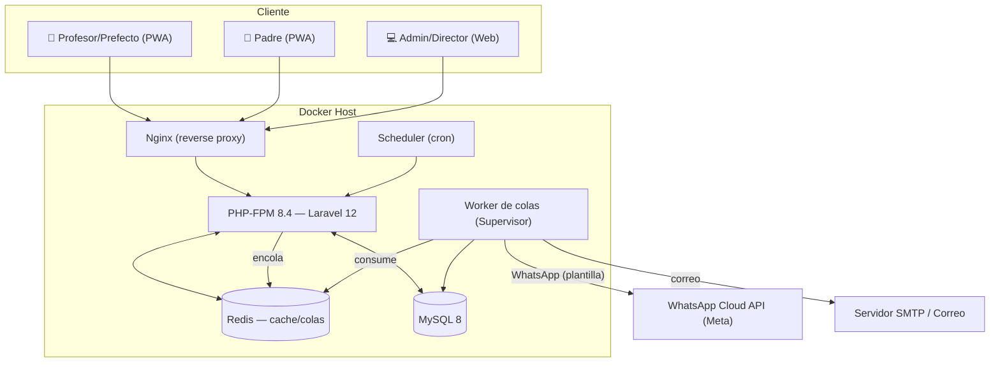
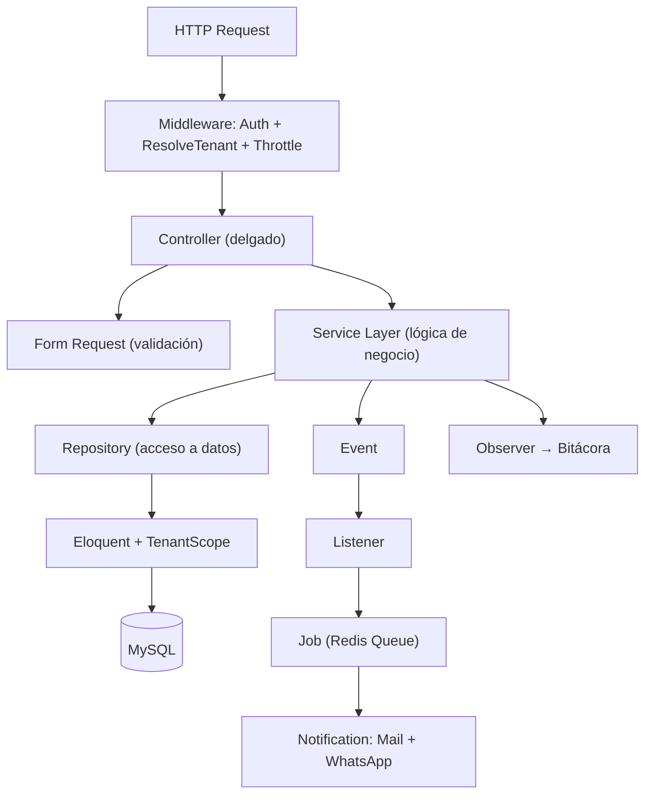
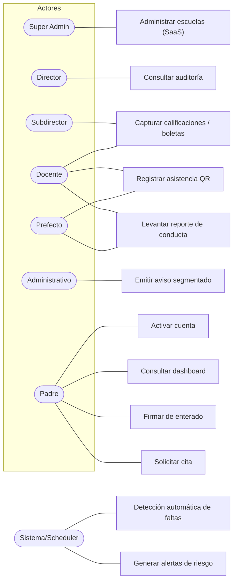
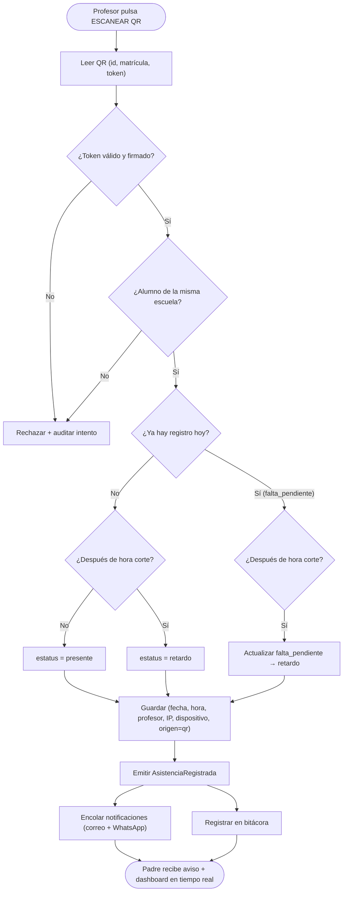
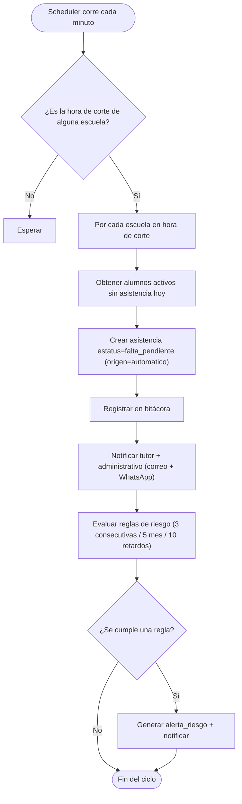
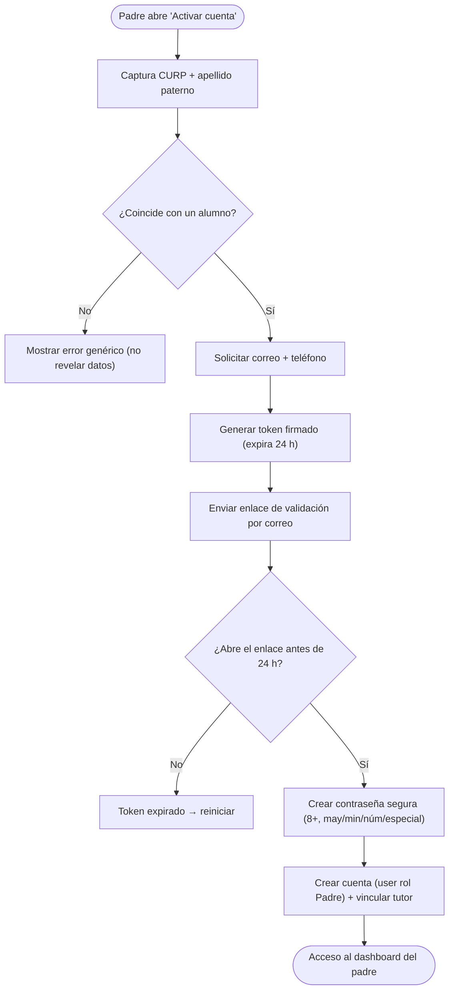

# 05 — Diagramas

Todos los diagramas en **Mermaid**.

---

## 1. Arquitectura de despliegue



---

## 2. Arquitectura por capas



---

## 3. Diagrama de casos de uso



---

## 4. Flujo de asistencia por QR



---

## 5. Flujo de notificaciones (correo + WhatsApp)

```mermaid
sequenceDiagram
    participant S as Service Asistencia
    participant E as Event Bus
    participant L as Listener
    participant Q as Cola (Redis)
    participant J as Job Notificación
    participant N as Notification
    participant MAIL as SMTP
    participant WA as Meta Cloud API
    participant T as Tutor

    S->>E: AsistenciaRegistrada
    E->>L: NotificarTutores
    L->>Q: dispatch(EnviarNotificacionJob)
    Note over Q,J: Procesado en segundo plano
    Q->>J: handle()
    J->>N: notify(tutores + administrativo)
    N->>N: via() = [mail, whatsapp]
    par Correo
        N->>MAIL: toMail() (asunto + cuerpo)
        MAIL-->>T: 📧 Correo de asistencia
    and WhatsApp
        N->>WA: toWhatsApp() (plantilla aprobada + variables)
        WA-->>T: 💬 WhatsApp de asistencia
    end
    Note over J: Reintentos con backoff; fallo de WA no afecta al correo
```

---

## 6. Flujo de faltas automáticas (Scheduler)



---

## 7. Flujo de activación del portal de padres


