# 06 — Roadmap de Implementación

> La construcción (FASE 2) **solo inicia cuando esta documentación está aprobada**.
> El orden prioriza primero los cimientos (multitenancy, auth, roles) y luego el flujo
> de mayor valor (asistencia QR + notificaciones), que es la operación diaria.

## Resumen de fases

```mermaid
flowchart LR
    F0["F0 · Cimientos"] --> F1["F1 · Catálogos"]
    F1 --> F2["F2 · Asistencia QR + Notif"]
    F2 --> F3["F3 · Faltas auto + Riesgo"]
    F3 --> F4["F4 · Académico + PDF"]
    F4 --> F5["F5 · Conducta + Avisos + Firmas"]
    F5 --> F6["F6 · Portal Padres + PWA"]
    F6 --> F7["F7 · Auditoría + Dashboards"]
    F7 --> F8["F8 · Hardening + Producción"]
```

---

## FASE 2 — Construcción (orden de entregables)

### Hito 0 — Cimientos del SaaS
- Proyecto Laravel 12 limpio + Docker (Nginx, PHP 8.4, MySQL 8, Redis, Supervisor).
- Breeze (Blade) + Bootstrap 5.3 + Alpine.js + Chart.js en el build (Vite).
- Spatie Permission: 7 roles + permisos base + seeders.
- **Multitenancy:** tabla `schools`, trait `BelongsToSchool`, `TenantScope`, middleware
  `ResolveTenant`. Pruebas de aislamiento `school_id`.
- Service Layer + Repository (contratos + binding en provider).
- Observer de auditoría + tabla `bitacora`.
- **Pruebas obligatorias:** ningún query cruza escuelas.

### Hito 1 — Catálogos y personas
- Migraciones/modelos/factories/seeders: `schools`, `ciclos_escolares`, `users`, `docentes`,
  `grados`, `grupos`, `materias`, `periodos`, `alumnos`, `tutores`, `alumno_tutor`.
- CRUD de alumnos (con documentos), tutores, docentes, grupos, materias, horarios.
- Expediente digital base + módulo médico.

### Hito 2 — Asistencia por QR + notificaciones (núcleo de valor)
- `qr_tokens` + generación de QR firmado por alumno.
- Lector QR en móvil (PWA) + endpoint de registro.
- `asistencias` con regla de unicidad diaria y cálculo presente/retardo.
- Eventos `AsistenciaRegistrada` → Jobs → **Notification Mail + WhatsAppChannel (Meta)**.
- Plantillas WhatsApp aprobadas; config `WHATSAPP_*`.
- Notificación en tiempo real en dashboard del padre.
- **Pruebas:** unicidad diaria, transición de estatus, encolado de notificaciones.

### Hito 3 — Faltas automáticas y alertas de riesgo
- Comando + Scheduler de hora de corte por escuela → `falta_pendiente`.
- Transición tardía `falta_pendiente → retardo` con notificación.
- Reglas de riesgo (3 consecutivas / 5 mes / 10 retardos) → `alertas_riesgo` + notificación.
- **Throttling de notificaciones:** la corrida de las 07:15 genera una ráfaga (cientos de
  WhatsApp simultáneos). Despachar en lotes / con rate limiting para respetar los límites de
  Meta Cloud API y evitar bloqueos del número.

### Hito 4 — Académico
- `calificaciones` por alumno/materia/periodo.
- Cálculo de promedios (materia/alumno/grupo) y "materias en riesgo".
- Boletas PDF (DomPDF) y kardex; exportaciones Excel.

### Hito 5 — Conducta, avisos y firmas
- `reportes` + `evidencias` (imagen/PDF/documento/video) desde móvil.
- `avisos` segmentados (escuela/grado/grupo/alumno) + adjuntos.
- `firmas_enterado` (polimórfica) con fecha/hora/IP.

### Hito 6 — Portal de padres + PWA
- Activación por CURP + apellido, enlace 24 h, contraseña segura.
- Dashboard del padre (asistencia, académico, comunicados, conducta).
- Citas. PWA (manifest + service worker) para padres y profesores.

### Hito 7 — Auditoría y dashboards ejecutivos
- Consulta de bitácora con filtros + exportación PDF/Excel/CSV.
- Dashboard ejecutivo con indicadores y gráficas Chart.js
  (asistencia semanal/mensual, rendimiento, conducta).

### Hito 8 — Endurecimiento y producción
- Rate limiting, revisión de policies/gates, validaciones, manejo de archivos.
- Cobertura de pruebas (PHPUnit) + Pint en CI.
- Supervisor para `queue:work` y `schedule:work`; despliegue Docker.
- Documentación final de operación y manual de usuario.

---

## Criterios de "listo" (Definition of Done) por hito
- Migraciones + modelos + factories + seeders.
- Servicios y repositorios con contratos.
- Form Requests + Policies aplicadas.
- Pruebas unitarias y de feature en verde.
- Aislamiento `school_id` verificado.
- Pint sin observaciones.

---

## Decisiones abiertas a confirmar antes de FASE 2
1. **Proveedor WhatsApp:** ✅ confirmado **Meta Cloud API** → se requiere número verificado y
   **plantillas aprobadas** (los avisos los inicia el sistema).
2. **Login SaaS:** ✅ confirmado **email único global** (el correo resuelve la escuela).
3. **Ciclo escolar:** ✅ confirmado **tabla `ciclos_escolares` + FK** (flag `vigente` marca el
   ciclo activo por escuela).
4. **Almacenamiento de archivos:** disco local vs S3/compatible (evidencias y documentos). *(pendiente)*
5. **Tiempo real del dashboard del padre:** polling simple vs WebSockets (Reverb/Pusher). *(pendiente)*
6. **Justificación de faltas:** ¿flujo de justificantes con evidencia y aprobación? *(pendiente)*
